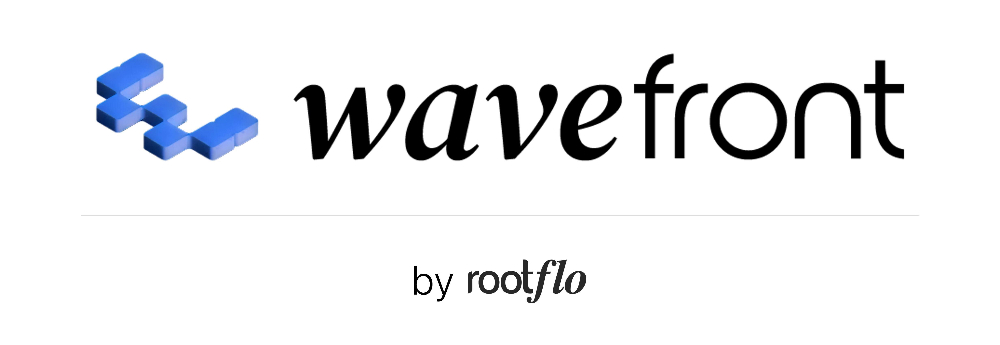
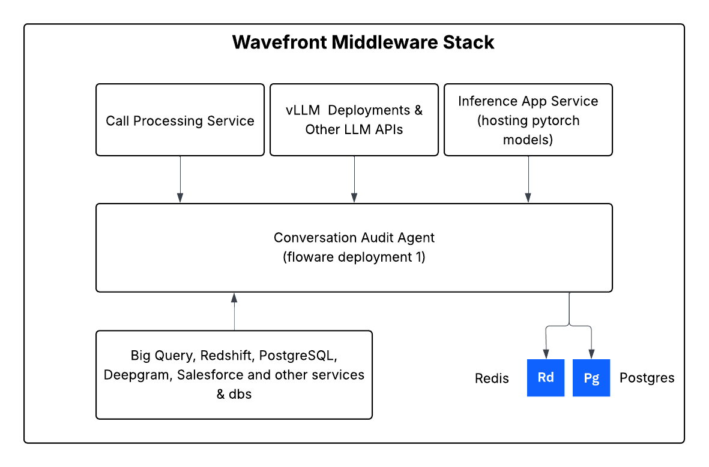
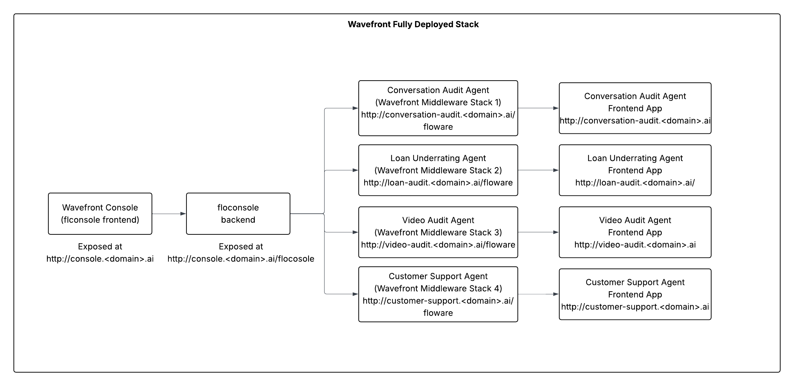

<p align="center">
  <a href="https://rootflo.ai">
  
  </a>
</p>

## Prerequisites

The project has its backend services written in python and frontend in reactjs. It has the following dependencies:

- Python >=3.11
- Node.js >=22.12
- uv >=0.7.15
- pnpm >=10.13.1

## Wavefront Overview

The platform consist of following components, which create a microservice mesh to provide scalable, secure, and reliable AI services. We have not used a fully microservice architecture as it is not necessary for our use case.

The platform consists of following components:

| Service | Port | Description | Release Status | 
|---------|------|-------------|----------------|
| **floware** | 8001 | Core AI middleware service. This service connects wavefront to multiple backends, databases, AI models and more. This is the core control center of the platform. | Beta |
| **floconsole** | 8002 | Management console service, this module is multi-app control centre for configuriong multiple apps on the wavefront middleware. | Beta |
| **inference_app** | 8003 | Inference App service. A simple service for running pytorch models. We right now support all models which works on pytorch version 0.16.0. | Experimental |
| **call_processing** | 8004 | Voice call processing service (Pipecat) | Beta |

#### Middleware High Level Architecture:

<p align="center">
  
</p>

#### Console High Level Architecture:

<p align="center">
  
</p>

The project is ready for production use only in Google Cloud Console and Amazon Web Services. 
In the current state of the project, it requires following cloud services to run locally (We are working on removing this dependencies for local runs):

- Google Cloud Storage or Amazon S3
- Google Cloud Pub/Sub or AWS SQS

## Quick Start

> [!WARNING]
> 
> - This project is under active development and APIs may change without notice. Please checkout the [platform docs](https://wavefront.rootflo.ai) for the latest information.
> - The platform is not in the GA state, and there are unimplemented feature. Checkout [ROADMAP.md](../ROADMAP.md) for the list of features, and whats missing.

### Docker Setup

You can use docker compose to setup the platform locally. Details on setting up using docker can be found in [DOCKER_SETUP.md](DOCKER_SETUP.md)

### Dev/Local Setup

**Step 1**: You can use the local setup to setup the platform locally. Start by cloning the repo and running the following commands:

```bash
chmod +x install-dep-local.sh
./install-dep-local.sh
```

This will install all the dependencies required to run the platform locally.

**Step 2**: Wavefront uses vscode (or its clone like cursor or anti-gravity) as the primary editor. We have provided a vscode workspace file to make it easier to work with the project. Open the workspace file in vscode and it will open the project in vscode.

Once you open the vscode you will be seeing three workspaces:

- `wavefront-root-dir`: This is the root directory of the project. With all the root-dir files
- `wavefront`: This is the backend & frontend service of the platform.
- `flo_ai`: The A2A orchestration library developed by RootFlo AI.

**Step 3**: Go to `wavefront` workspace and open the server directory. In the directory go to `apps`, where you can find all the services mentioned in the table above. Open each of the setup `.env` files with environment variables as mentioned in the [DOCKER_SETUP.md](DOCKER_SETUP.md).

**Step 4**: Run all the backend services services. Check the floware health at http://localhost:8001/floware/v1/health.

**Step 5**: Go to `wavefront` workspace and open the client directory. Add the neccessary environment variables in the `.env` file. Run the following commands to start the frontend services:

```bash
pnpm install
pnpm run dev
```

Now open http://localhost:5173 in your browser to see the frontend & login with the credentials set in environment variables.

**Step 6**: Go to the console, add your first app by clicking on the `Add App` button. Use the details of the floware service you started on Step 4

## Next Steps

Connect your datasources, and create your first agent & workflow or go ahead an try out the voice bot feature. 

- Checkout the platform docs here [https://wavefront.rootflo.ai](https://wavefront.rootflo.ai/).
- Incase you face any issues, dont hesitate to reach out to schedule a call with us [here](https://calendly.com/meetings-rootflo/30min)